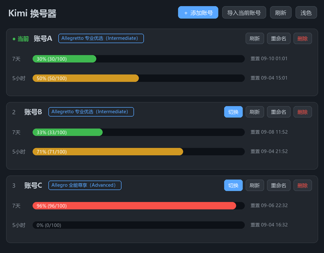
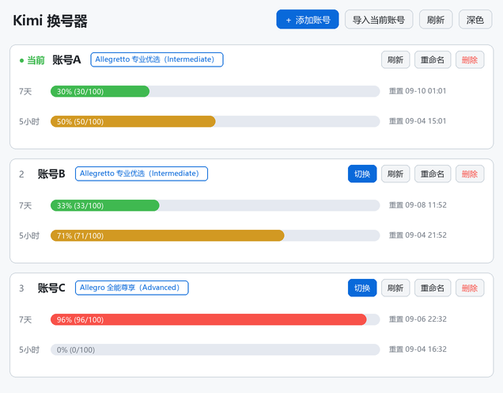

# kimi-switch · Kimi 换号器

[Kimi Code](https://www.kimi.com/) 多账号管理工具：浏览器授权添加账号、一键切换、额度一目了然。
提供 Windows 图形界面和命令行两个版本，单文件 exe、无运行时依赖。





## 功能

- **浏览器授权添加账号**：点「＋ 添加账号」获取授权链接，在浏览器登录授权后自动入库（OAuth Device Flow），全程不影响当前正在使用的账号。
- **一键切换账号**：点「切换」原子替换 `~/.kimi-code/credentials/kimi-code.json`，**无需退出重登、无需重启**，立即生效；每次切换自动留快照，失败可回滚。
- **导入当前账号**：把本机 Kimi Code 已登录的账号一键收进账号库。
- **额度可视化**：5 小时 / 7 天双窗口彩色进度条（绿 → 黄 → 橙 → 红），附带窗口重置时间和会员等级徽章；额度查询有缓存节流与失败退避，不会高频打接口。
- **会员套餐对照**：接口返回的会员等级（如 `LEVEL_ADVANCED`）会自动翻译成 Kimi 官网套餐名一并显示，例如徽章显示「Allegro 全能尊享（Advanced）」。已确认的对照：`Intermediate` = Allegretto 专业优选（199 档）、`Advanced` = Allegro 全能尊享（699 档）；未确认的等级按原名显示。
- **账号管理**：重命名别名、删除（带确认弹窗）。
- **深色 / 浅色主题**：随时一键切换。
- **凭证安全**：token 只保存在本机私有目录（Unix 下 0600 权限），网络请求只发往 Kimi 官方域名（`auth.kimi.com` / `api.kimi.com`），零遥测；token 刷新与官方客户端使用同一套锁协议协调，不会互相抢刷。

## 安装

### 下载成品

从 [Releases](../../releases) 下载 `kimi-switch.exe`（图形界面）或 `kimi-switch-cli.exe`（命令行），双击即用。

### 从源码构建

需要 Rust 1.80+：

```bash
git clone https://github.com/yuan2627/kimi-switch.git
cd kimi-switch
cargo build --release
```

产物：`target/release/kimi-switch.exe`（图形界面）、`target/release/kimi-switch-cli.exe`（命令行）。

## 使用

### 图形界面

双击 `kimi-switch.exe`：

| 操作 | 说明 |
|---|---|
| ＋ 添加账号 | 弹出授权链接 → 浏览器登录授权 → 自动入库 |
| 导入当前账号 | 把 Kimi Code 当前登录的账号存入账号库 |
| 切换 | 把该账号写入本地凭证，立即生效 |
| 重命名 | 给账号起别名（账号 id 是一串随机字符，别名方便辨认） |
| 删除 | 从账号库移除（不影响 Kimi Code 当前登录文件） |
| 刷新 | 重新拉取各账号额度 |

### 命令行

```bash
kimi-switch-cli                 # 账号列表 + 5h/7d 额度
kimi-switch-cli login kimi      # 导入当前 Kimi Code 已登录账号
kimi-switch-cli swap <编号或id>  # 切换激活账号
kimi-switch-cli rm <编号或id>    # 删除账号
```

GUI 与 CLI 共用同一份账号库（`%APPDATA%\kimi-switch\`），可以混用。

## 常见问题

**切换后需要重启 Kimi Code 吗？**
不需要。凭证是每次请求时读取的，切换即时生效。

**账号库的凭证安全吗？**
所有 token 只存在你自己的电脑上（`%APPDATA%\kimi-switch\` 下的私有文件），不会上传到任何第三方服务器。源码中唯一的网络请求是 Kimi 官方的授权与额度接口。

**账号放久了切换过去提示 401？**
refresh token 有有效期，长期未使用的账号可能需要在 Kimi Code 里重新登录一次再导入。

## 免责声明

本工具为个人开源项目，与 Moonshot AI / Kimi 官方无关。多账号使用方式可能涉及官方服务条款的灰色地带，请自行评估风险，账号安全与使用后果自负。本项目仅供学习交流。

## License

[MIT](LICENSE)
